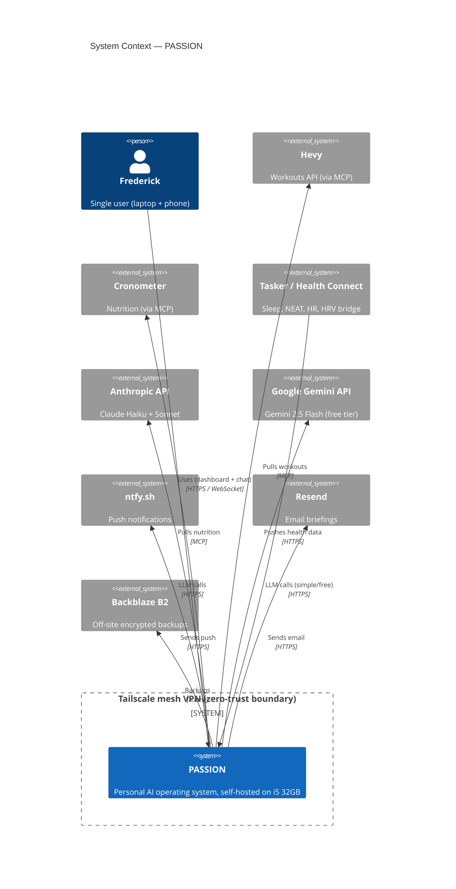
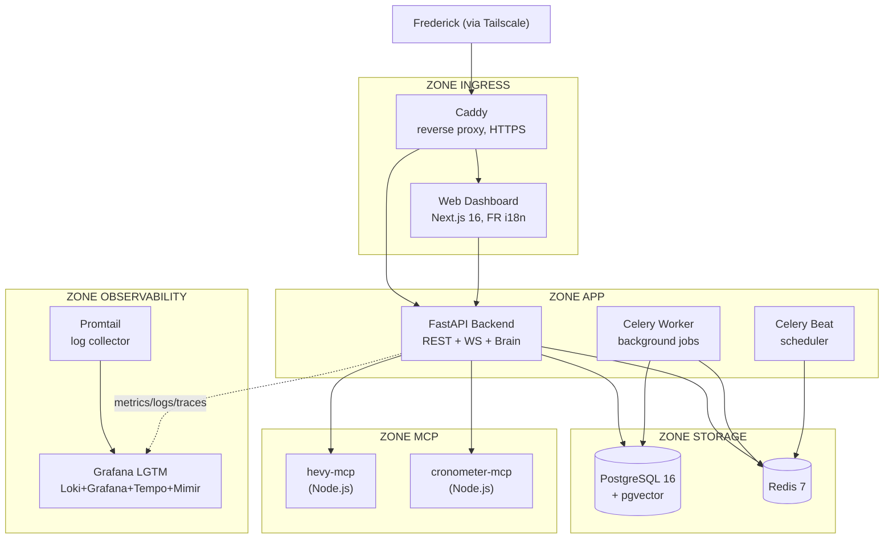
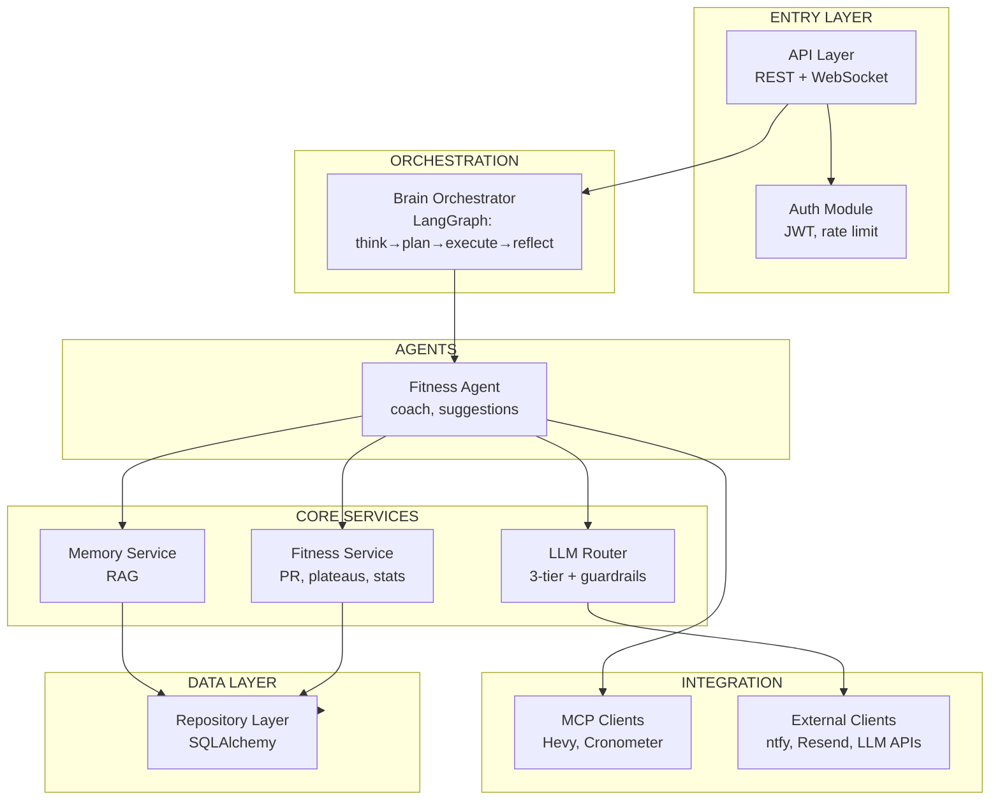
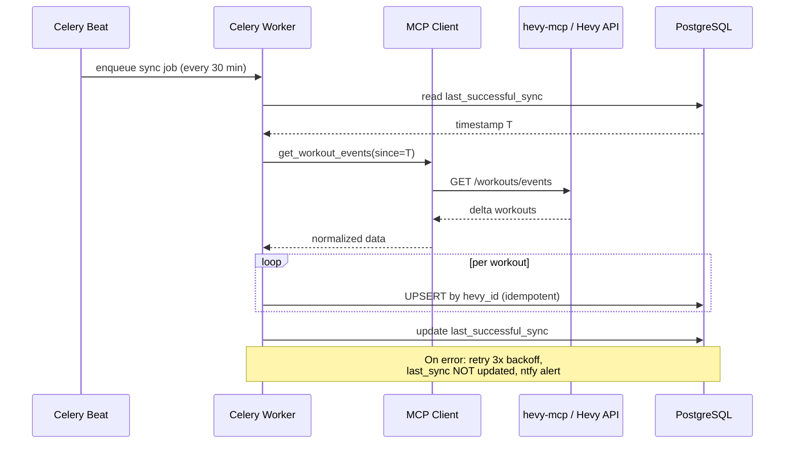
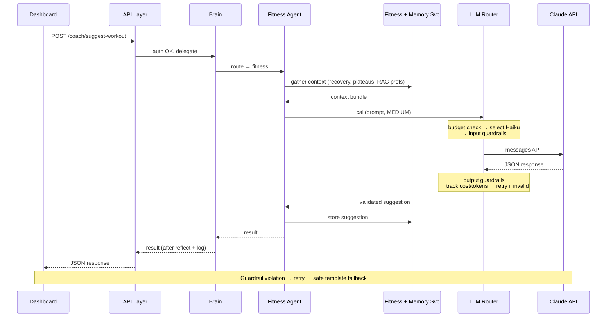
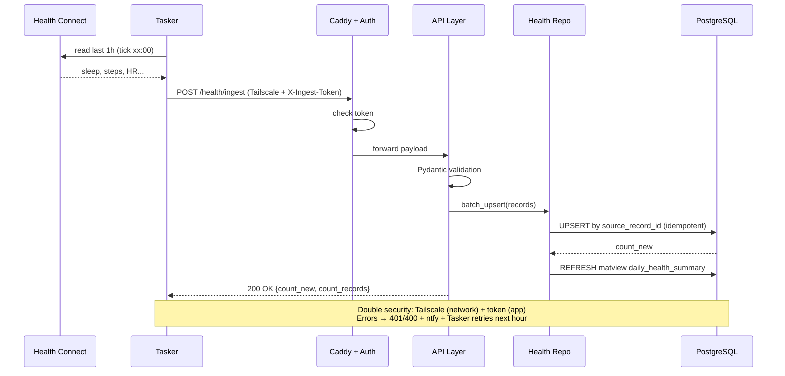
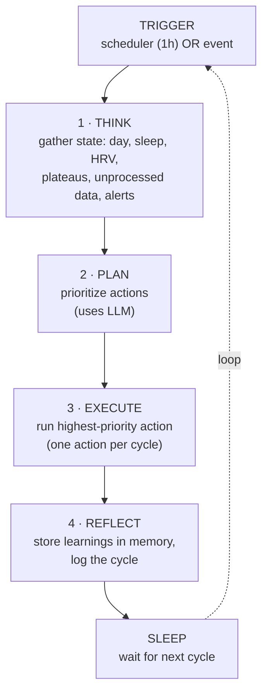

# ARCHITECTURE — Personal AI Operating System (PASSION)

> Consolidated technical architecture: C4 model, data flows, database, tech stack.
>
> **Version:** 1.0
> **Date:** May 2026
> **Status:** Architecture locked, ready for Sprint 1

This document ties together the architecture. For details see:
- [SPECIFICATIONS.md](./SPECIFICATIONS.md) — functional requirements (33 user stories)
- [NON_FUNCTIONAL_REQUIREMENTS.md](./NON_FUNCTIONAL_REQUIREMENTS.md) — 52 NFRs
- [API_CONTRACTS.md](./API_CONTRACTS.md) — 41 REST endpoints + WebSocket
- [decisions/](./decisions/) — Architecture Decision Records (ADR-001..004)

---

## TABLE OF CONTENTS

1. [System overview](#1-system-overview)
2. [C4 Level 1 — System Context](#2-c4-level-1--system-context)
3. [C4 Level 2 — Containers](#3-c4-level-2--containers)
4. [C4 Level 3 — Components](#4-c4-level-3--components)
5. [Data flows](#5-data-flows)
6. [Database architecture](#6-database-architecture)
7. [Technology stack (locked)](#7-technology-stack-locked)
8. [Folder structure](#8-folder-structure)
9. [Cross-cutting concerns](#9-cross-cutting-concerns)

---

## 1. SYSTEM OVERVIEW

PASSION is a 24/7 self-hosted personal AI operating system. The MVP delivers an
autonomous **Fitness agent** that ingests workout (Hevy), nutrition (Cronometer),
and health (Health Connect) data, then coaches the user through a dashboard and a
real-time chat — while a **Brain orchestrator** runs autonomous cycles in the
background.

**Core architectural principles:**
- **Single user, self-hosted** — no multi-tenancy, runs on an existing i5 32GB Linux box (ADR-003).
- **Zero public exposure** — access only via Tailscale mesh VPN (ADR-004).
- **Clean architecture** — dependencies point inward (api → services → repositories → models).
- **MCP-first integrations** — reuse existing MCP servers, build custom only when differentiating (ADR-002).
- **Cost-controlled LLM** — 3-tier routing with a hard 45 €/month cap (ADR-002).
- **Observable by default** — full Grafana LGTM stack (logs, metrics, traces).

---

## 2. C4 LEVEL 1 — SYSTEM CONTEXT

Who interacts with PASSION and which external systems it talks to.



**Key:** Everything between Frederick and PASSION traverses Tailscale — there is no
public endpoint. Health Connect is a passive on-device store; Tasker is the active
bridge that reads it and pushes hourly.

---

## 3. C4 LEVEL 2 — CONTAINERS

The internal architecture: 10 containers across 5 zones.



**Container simplification rationale:** Celery Worker and Beat share one Docker
image (two compose services). The observability stack is the single Grafana LGTM
image (Loki + Grafana + Tempo + Mimir) instead of four separate containers.

---

## 4. C4 LEVEL 3 — COMPONENTS

Inside the FastAPI Backend (the most complex container), following clean architecture.



**The dependency rule:** outer layers depend on inner layers, never the reverse.
The Fitness Service (business logic) does not know a database exists — it receives
data and returns results, which is what makes it unit-testable to 90%+.

---
## 5. DATA FLOWS

The four flows that capture every interaction pattern in the system.

### Flow 1 — Hevy sync (autonomous, every 30 min)



**Key design:** idempotent UPSERT by `hevy_id`, and `last_successful_sync` is only
updated on success — so any gap is automatically caught up on the next run.

### Flow 2 — Workout suggestion (the reusable LLM pattern)



This is a **template**: every future agent (career, finance...) follows the same
sequence — only the gathered context and guardrails change.

### Flow 3 — Health Connect ingestion (hourly, secured)



### Flow 4 — Brain cycle (autonomous, "what PASSION does while you sleep")



**Two critical design decisions:** (1) **one action per cycle** — prevents runaway
loops and controls budget; (2) **REFLECT feeds memory** — each cycle makes the agent
sharper about Frederick specifically.

---

## 6. DATABASE ARCHITECTURE

28 tables across 8 domain groups (PostgreSQL 16 + pgvector). Full DDL in
[../db/schema.sql](../db/schema.sql); ORM models in `backend/src/models/`.

| Group | Tables |
|---|---|
| Auth & System | llm_config, notification_config, auth_attempts, agent_actions* |
| Workouts | exercise_templates, workouts, workout_exercises, workout_sets, sync_state |
| Targets & Context | training_context, exercise_targets, program_split |
| Analysis | personal_records, exercise_analysis, weekly_stats, monthly_stats |
| Health | health_metrics*, health_markers (+ daily_health_summary matview) |
| Coaching | workout_suggestions, nutrition_plans, challenges |
| Gamification | missions, xp_log, user_level, streaks |
| Memory & Chat | agent_memory, conversations, messages |

`*` = partitioned by quarter (RANGE on the timestamp).

**Advanced patterns applied:**
- **Quarterly partitioning** on `health_metrics` and `agent_actions` (time-series, NFR-PERF-005).
- **HNSW vector index** on `agent_memory.embedding` for RAG retrieval (cosine similarity).
- **BRIN index** on `health_metrics.recorded_at` (ultra-light for ordered time-series).
- **GIN indexes** on JSONB and array columns.
- **Partial indexes** (`WHERE status='active'`, `WHERE is_obsolete=false`).
- **Materialized view** `daily_health_summary`, refreshed CONCURRENTLY nightly.
- **Defensive denormalization**: `exercise_title` (resilient to unmapped exercises),
  `total_volume_kg` (precalculated for read performance).

**Migration:** managed by Alembic. The initial migration is hand-written (autogenerate
cannot express partitioning / HNSW / matviews). Validated against Postgres 16 + pgvector:
upgrade, downgrade, and zero-drift autogenerate check all pass.

---

## 7. TECHNOLOGY STACK (LOCKED)

Versions resolved and locked as of May 2026. Backend lockfile:
`backend/requirements.lock.txt` (101 runtime + 122 dev packages, dependency tree
validated as mutually compatible).

### Backend (Python 3.12)

| Technology | Version | Role |
|---|---|---|
| FastAPI | 0.136.3 | REST + WebSocket API |
| Uvicorn | 0.47.0 | ASGI server |
| Pydantic | 2.13.4 | Validation, schemas, settings |
| SQLAlchemy | 2.0.49 | ORM (async) |
| Alembic | 1.18.4 | DB migrations |
| asyncpg | 0.31.0 | Async Postgres driver |
| pgvector | 0.4.2 | Vector columns / RAG |
| Redis (redis-py) | 7.4.0 | Cache + Celery broker |
| Celery | 5.6.3 | Background jobs + scheduler |
| Anthropic SDK | 0.104.1 | Claude Haiku + Sonnet |
| google-genai | 2.6.0 | Gemini Flash |
| LangGraph | 1.2.1 | Agent orchestration |
| MCP SDK | 1.27.1 | MCP client |
| bcrypt | 5.0.0 | Password hashing |
| PyJWT | 2.13.0 | JWT sessions |
| structlog | 25.5.0 | Structured logging |
| prometheus-client | 0.25.0 | Metrics |
| OpenTelemetry | 1.28+ | Tracing |
| httpx | 0.28.1 | HTTP client |

### Frontend (Node 22 / TypeScript)

| Technology | Version | Role |
|---|---|---|
| Next.js | 16.2.x | Dashboard (App Router) |
| React | 19.2.x | UI |
| next-intl | 4.12.x | i18n (FR default) |
| Tailwind CSS | 4.3.x | Styling (CSS-first config) |
| TypeScript | 6.0.x | Types |
| Vitest | 4.1.x | Tests |
| ESLint | 10.4.x | Linting |
| lucide-react | 0.468.x | Icons |
| recharts | 2.15.x | Charts |

> **Note on Tailwind 4:** uses CSS-first configuration (`@import "tailwindcss"` +
> `@theme` in `globals.css`), no `tailwind.config.ts` by default.

### Dev tooling

| Tool | Version | Role |
|---|---|---|
| ruff | 0.15.x | Lint + format (Python) |
| mypy | 2.1.x | Type checking (strict) |
| pytest | 9.0.x | Test runner |
| pytest-bdd | 8.1.x | Gherkin → executable tests |
| testcontainers | 4.14.x | Disposable Postgres for tests |
| pre-commit | — | Git hooks (ruff + mypy) |

### Infrastructure

| Technology | Role |
|---|---|
| Docker + Compose | Container orchestration (10 services) |
| Caddy 2 | Reverse proxy, HTTPS |
| PostgreSQL 16 (pgvector image) | Database |
| Redis 7 | Cache + queues |
| Grafana LGTM | Observability (Loki/Grafana/Tempo/Mimir) |
| Promtail | Log collection |
| Tailscale | Zero-trust network access |
| GitHub Actions | CI/CD |
| age + rclone + Backblaze B2 | 3-2-1 encrypted backups |

---

## 8. FOLDER STRUCTURE

See [PROJECT_STRUCTURE.md](../PROJECT_STRUCTURE.md) for the complete tree (95 files).
High level:

```
passion-project/
├── backend/    # FastAPI + LangGraph + Celery (clean architecture)
│   └── src/    # core, db, models, schemas, repositories, services,
│               # llm, memory, brain, agents, integrations, jobs, api
├── frontend/   # Next.js 16 (App Router, FR i18n)
├── infra/      # docker-compose, Caddy, Grafana LGTM, backup scripts
├── docs/       # specs, NFR, API contracts, ADRs, this file
└── db/         # canonical schema.sql
```

---

## 9. CROSS-CUTTING CONCERNS

| Concern | Approach | Reference |
|---|---|---|
| **Auth** | bcrypt + JWT, 2 levels (user / system) | NFR-SEC-001 |
| **Secrets** | `.env` only, never committed | NFR-SEC-002 |
| **Network** | Tailscale only, zero public exposure | ADR-004 |
| **LLM cost** | 3-tier routing, 45 €/month hard cap | ADR-002, NFR-COST |
| **Observability** | structlog + Prometheus + Tempo → Grafana | NFR-OBS |
| **Idempotence** | UPSERT by natural keys everywhere | NFR-REL-005 |
| **Backups** | 3-2-1, age-encrypted, off-site B2 | NFR-REL-003 |
| **Testing** | TDD hybrid, 80%+ backend, BDD via pytest-bdd | NFR-TEST |
| **i18n** | UI in FR (next-intl), code/docs in EN | NFR-UX-004 |
| **Privacy** | self-hosted, @sensitive forces Anthropic-only | NFR-PRIV-002 |

---

*Generated May 2026 — Frederick × Claude. Architecture locked, ready for Sprint 1.*
