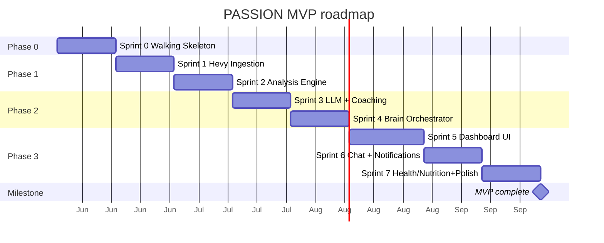

# ROADMAP — Personal AI Operating System (PASSION)

> Phased, sprint-by-sprint plan from walking skeleton to portfolio-ready MVP.
>
> **Version:** 1.0
> **Date:** May 2026
> **Estimate:** ~16-18 weeks at 10-20h/week (MVP = Phases 0→3)

See [ARCHITECTURE.md](./ARCHITECTURE.md), [SPECIFICATIONS.md](./SPECIFICATIONS.md),
[NON_FUNCTIONAL_REQUIREMENTS.md](./NON_FUNCTIONAL_REQUIREMENTS.md),
[API_CONTRACTS.md](./API_CONTRACTS.md).

---

## SEQUENCING PRINCIPLES

1. **Walking skeleton first** — Sprint 0 makes everything *run* end-to-end (Docker,
   DB, Tailscale, auth, observability, CI) before any business logic is stacked on top.
2. **Vertical slices** — each sprint ships a complete, usable slice (DB + logic +
   API/UI), not a horizontal layer. You can *see* something work at the end of each.
3. **Dependency order** — data → analysis → intelligence → interface → completeness.
   The LLM can't coach without analysis context; analysis needs workout data first.
4. **TDD/BDD loop** — the Gherkin scenarios in SPECIFICATIONS.md become each sprint's
   acceptance tests (pytest-bdd). Red → Green → Refactor on critical modules.

---

## TIMELINE OVERVIEW

---

## PHASE 0 — FOUNDATIONS

### Sprint 0 — Walking Skeleton ✅ DONE (May 2026)

**Goal:** every container runs and the end-to-end plumbing is proven. Nothing
useful yet, but the foundation is solid.

**Delivered**
- `docker compose up` → 8 containers default (caddy, frontend, backend, celery
  worker+beat, postgres, redis, grafana-lgtm), 9 with `--profile linux-host`
  (adds promtail). MCP servers spawned in-process per ADR-002 (not separate
  containers — pragmatic decision, see [src/integrations/mcp/](../backend/src/integrations/mcp/))
- PostgreSQL 16 + pgvector, full schema via `alembic upgrade head` (28 tables,
  partitions, HNSW + BRIN indexes, matview)
- FastAPI `/health` → 200 with DB+Redis ping; 503 if degraded
- Frontend serves a placeholder page (real UI = Sprint 5)
- **Auth working** (US-001): bcrypt cost 12 + HS256 JWT, `POST /auth/login`,
  `GET /auth/me`, `POST /auth/system-unlock`. Default admin password "changeme"
  with loud startup warning + `python -m src.scripts.hash_password` to rotate.
- structlog (JSON, secret masking) + Prometheus `/metrics` (passion_api_up,
  passion_http_requests_total) + OTel push to grafana-lgtm:4318 → Mimir/Tempo/Loki.
  Grafana datasources + dashboard "PASSION — API overview" provisioned.
- CI green: ruff + ruff format + mypy strict + alembic migrate + pytest (22 tests)
- `.env` / secrets in place (gitignored)
- Project root `compose.yaml` shim → `docker compose` works from any subdir

**Covers:** US-001 · NFR-SEC-001/002/003, OBS-001/002/003, MAINT-006

**Deferred to later sprints (originally in S0 scope):**
- Tailscale + Caddy HTTPS production hardening (S7)
- Automated backups + restore drill (S7 — NFR-REL-003)
- Frontend dashboard shell (S5)

---

## PHASE 1 — FITNESS DATA

### Sprint 1 — Hevy Ingestion ✅ DONE (May 2026)

**Goal:** real workout data flows from Hevy into the DB, autonomously.

**Delivered**
- `McpHevyClient` ([backend/src/integrations/mcp/hevy.py](../backend/src/integrations/mcp/hevy.py))
  spawns `npx -y hevy-mcp` as a stdio subprocess inside the backend container
  (nodejs added to image). Protocol-based design with a `FakeHevyClient` for
  tests. Defensive decoder handles single block / multiple blocks / double-encoded
  JSON / MCP error strings, and detects Hevy "Page not found" as clean
  end-of-pagination.
- `sync_hevy` orchestrator service ([backend/src/services/fitness/sync.py](../backend/src/services/fitness/sync.py)):
  paginates exercise templates → upserts (FK target) → paginates workouts →
  UPSERT idempotent by `hevy_id`. Gracefully drops FK to unknown templates
  (keeps `title`). Marks `sync_state.last_successful_sync` only on success.
- Celery task `sync_hevy_workouts` ([backend/src/jobs/tasks.py](../backend/src/jobs/tasks.py)):
  autoretry 3× with exponential backoff (60s→900s, US-008 sc.4), `worker_redirect_stdouts=False`
  so subprocess MCP can inherit FDs, ntfy alert on final retry failure.
- Celery Beat schedule: every 30 min (US-008).
- Repositories ([backend/src/repositories/workouts.py](../backend/src/repositories/workouts.py)):
  `BaseRepository[T]` (PEP 695), `WorkoutRepository` (UPSERT + paginated list with
  date/muscle_group/exercise filters, eager-loaded), `ExerciseTemplateRepository`
  (bulk UPSERT via `INSERT … ON CONFLICT`), `SyncStateRepository`.
- API ([backend/src/api/v1/workouts.py](../backend/src/api/v1/workouts.py)):
  `GET /workouts` (paginated + filters), `GET /workouts/{id}` (detail, eager
  exercises+sets), `POST /workouts/sync` (202 + job_id).
- ntfy minimal client ([backend/src/integrations/external/ntfy.py](../backend/src/integrations/external/ntfy.py)).
- Tests (33 total, +11 vs S0): unit (Hevy normalize × 4) · integration repos via
  testcontainers Postgres+pgvector (4 tests) · acceptance for US-008 (3 scenarios
  from `hevy_sync.feature`). CI updated with `TESTCONTAINERS_RYUK_DISABLED=true`.

**Real-world validation (against my own Hevy Pro account):**
- 1 manual `POST /workouts/sync` → **434 exercise templates** + **80 workouts**
  imported in **~7.5 seconds** (9 pages of workouts × 10 + ~44 pages of templates × 10)
- Re-sync = 0 new, 80 updated (UPSERT idempotent ✓)
- All exercise sets (reps, RPE) preserved correctly

**Covers:** US-008, US-008b(prep), US-009, US-010 · NFR-REL-002/004/005, PERF-002

**Deferred to Sprint 2:**
- `total_volume_kg` computation (needs exercise type knowledge → analysis engine)
- `WorkoutExercise.title` enrichment by joining `exercise_templates` in the
  detail serialiser (currently null because Hevy MCP doesn't include it in
  workout payload, only `exercise_template_id`)

**Other Sprint 1 TODOs (sprint-2+):**
- Rate-limit on `POST /workouts/sync` via Redis (US-009 sc.2, 30s/IP)
- Pause Celery Beat + critical ntfy on 401 Hevy (US-008 sc.6 — currently retries normally)
- Switch to `get-workout-events?since=` if hevy-mcp exposes it, for true
  incremental (currently full re-sync each run, idempotent → cheap but wasteful)

### Sprint 2 — Analysis Engine ✅ DONE (May 2026)

**Goal:** the agent understands my training — PRs, plateaus, stats. Pure logic,
high coverage (TDD).

**Delivered**
- Pure fitness services (no I/O, all >93% unit-tested):
  - [pr_detection.py](../backend/src/services/fitness/pr_detection.py) — 4 PR types
    (`one_rep_max` Epley, `reps_at_load` bucketed by 5kg, `session_volume`,
    `muscle_group_volume` weekly) — skips warmup/failure/dropset
  - [plateau.py](../backend/src/services/fitness/plateau.py) — `plateau_official`,
    `plateau_stalled`, `regression`, `behind_schedule` — **context-aware**
    (thresholds widen during cutting, see `_PLATEAU_THRESHOLD_SESSIONS`)
  - [stats.py](../backend/src/services/fitness/stats.py) — weekly/monthly aggregations:
    sessions, volume, volume/muscle-group, top-5 exercises, sessions-by-day
  - [recovery.py](../backend/src/services/fitness/recovery.py) — per-muscle state
    (`ready / recovering / heavy_fatigue / neglected`) with per-group recovery windows
  - [targets.py](../backend/src/services/fitness/targets.py) — baseline → current →
    target progression (`on_track / behind / ahead / achieved / expired`)
- [analysis_runner.py](../backend/src/services/fitness/analysis_runner.py) —
  DB ↔ pure-services bridge: full rescan, fresh baselines, upserts everything
- Repositories (`PersonalRecord`, `ExerciseAnalysis`, `WeeklyStats`, `MonthlyStats`,
  `TrainingContext`, `ExerciseTarget`)
- API: `GET /analysis/{prs,plateaus,targets,muscle-status,stats}` +
  `GET /analysis/exercise/{id}/progression`
- Celery Beat job `nightly_analysis` @ 03:30 UTC, autoretry 2× with backoff,
  ntfy alert on final failure
- [training_seed.yaml](../backend/config/training_seed.yaml) — full PHUL V2 Bodyland
  (24 exercises, baselines + 3-month targets + long-term goals, retired exercises
  *excluded* per training program policy)
- Idempotent seed loader: `python -m src.scripts.seed_training`
- Sprint 1 cleanups: `total_volume_kg` precomputed at workout upsert, workout
  detail endpoint joins exercise_templates for `title`/`primary_muscle_group`
- **Hevy field-mapping fix**: Hevy MCP returns `weight` (not `weightKg`) and
  `name` (not `title`) for exercises — `normalize_workout()` updated, real
  weights now flowing into DB (~80 workouts with full numeric data)

**Coverage** — services/fitness pure modules:
| Module | Coverage |
|---|---|
| pr_detection.py | 98% |
| plateau.py | 96% |
| recovery.py | 97% |
| stats.py | 99% |
| targets.py | 93% |
| **Total** | **97%** (CI gate ≥90% — see `.coveragerc-fitness`) |

**Real-world validation against the user's Hevy account:**
- 1 trigger of `nightly_analysis` on 80 real workouts → **352 PRs detected**,
  **23 plateau findings** (incl. `plateau_stalled` on a now-retired exercise),
  weekly+monthly stats persisted — full run in **149 ms**
- `GET /analysis/stats?period=month` → 4 sessions in May 2026, 20644.5kg
  volume, top muscles: upper_back / lats / quadriceps
- `GET /analysis/targets` → Bench Press 16% progress (ahead_of_schedule),
  Lat Pulldown 73%, Pull Up 0%
- 73 tests passing (41 unit pure fitness + Sprint 0/1 still green)

**Covers:** US-011, US-012, US-013, US-013b, US-014, US-015 · NFR-TEST-001/002

**Sprint 2 TODOs / deferred to Sprint 3+:**
- BDD `.feature` files for pr_detection & plateau (currently spec-as-test
  in `test_pr_detection.py` / `test_plateau.py`)
- "Exercise retired" filter: plateau findings on retired exercises (e.g.
  "Squat (Barre)") should be suppressed (add a `retired_exercises` field in
  training_context)
- `bucket` granularity per exercise (current 5kg uniform — mollets / leg press
  could use 10kg)
- Materialised-view `daily_health_summary` refresh (waits for S7 health data)

---

## PHASE 2 — INTELLIGENCE

### Sprint 3 — LLM Router + Coaching (~2 weeks)

**Goal:** smart, personalized, cost-controlled coaching.

**Deliverables**
- LLM Router (3-tier: Gemini Flash / Haiku / Sonnet) + provider clients
- `BudgetTracker` (45 €/month cap, pre-call check, fallback to Gemini free)
- Guardrails (input/output validation, `@sensitive` → Anthropic-only)
- Workout suggestion (Flow 2) + nutrition plan
- API: `POST /coach/suggest-workout`, `/coach/suggestion/{id}/respond`,
  `/coach/nutrition-plan`
- `llm_routing.yaml` wired; LLM cost tracking → Grafana dashboard
- BDD: `workout_suggestion.feature`

**Covers:** US-016, US-017 · NFR-COST-001/002/004, SEC-007, OBS (LLM dashboard)

**Definition of done:** I ask for today's workout → I get a personalized suggestion
adapted to my recovery/sleep, the cost is tracked, and the budget cap holds.

### Sprint 4 — Brain Orchestrator (~2 weeks)

**Goal:** the system runs autonomously — think → plan → execute → reflect.

**Deliverables**
- Brain graph (LangGraph) + `BrainState` + nodes (think/plan/execute/reflect/route)
- Memory Service (RAG, embeddings, retrieval, background extractor) + `agent_memory`
- Brain cycle Celery job (Flow 4), one action per cycle
- Agent action logging (`agent_actions`)
- API: `GET /dashboard/overview`, `/dashboard/system-matrix`, agent status
- US-002 (status), US-004 (memory), US-005 (activity log)

**Covers:** US-002, US-004, US-005, US-007(partial) · NFR-SCA, OBS-004

**Definition of done:** overnight, the brain runs cycles, generates my morning
briefing, and remembers things I told it earlier.

---

## PHASE 3 — INTERFACE + COMPLETENESS

### Sprint 5 — Dashboard UI (~2-3 weeks)

**Goal:** a real, usable dashboard — the face of the system.

**Deliverables**
- Dashboard overview (agent status, missions, health snapshot)
- Training log + workout detail + body scanner (SVG) + PR history
- Analysis views (stats, targets, plateaus, progression charts)
- Nutrition + Health views (snapshot, trends)
- i18n FR, dark mode, responsive (phone + laptop)
- Vitest coverage on hooks + shared components

**Covers:** US-002, US-010, US-011, US-015, US-026 (UI) · NFR-UX-001/002/003/004, PERF-003, COMPAT

**Definition of done:** I open the dashboard on phone and laptop; everything renders
in FR, dark, and fast (Core Web Vitals targets met).

### Sprint 6 — Chat + Notifications (~2 weeks)

**Goal:** real-time coaching conversation + proactive alerts.

**Deliverables**
- WebSocket `/ws/chat` (token streaming, stop, quick actions)
- Direct Line + coach chat UI; conversation/message persistence
- Notifications: ntfy + Resend; daily briefing job (US-006)
- API: chat endpoints, notification config

**Covers:** US-003, US-006a, US-006b, US-020, US-021, US-024 · NFR-PERF-001 (WS), REL

**Definition of done:** I chat with my coach in real-time (streaming), and I get a
morning briefing on my phone + email.

### Sprint 7 — Health/Nutrition Ingestion + Gamification + Polish (~2 weeks)

**Goal:** complete the data picture, gamify, and harden for "production".

**Deliverables**
- Tasker setup + `/health/ingest` (Flow 3) + health repos
- `cronometer-mcp` + nutrition sync + meal suggestions
- Manual health markers (blood panels) — US-027
- Gamification: streaks, missions, XP, weekly challenges
- Hardening: automated backups (cron), alerting rules, docs pass

**Covers:** US-018, US-019, US-022, US-023, US-025, US-027 · NFR-PRIV, REL-003, OBS-005

**Definition of done:** full MVP — all data flowing (workouts, nutrition, health),
gamified, observable, backed up. Portfolio-ready. 🎯

---

## PHASE 4+ — EXPANSION (post-MVP)

Not scheduled; pulled in by interest/value after the MVP ships.

- **New agents:** Career (job hunting), Finance, Social, Code, Journal, Intel
- **Hevy:** webhooks (replace polling), bidirectional sync, custom `passion-hevy-mcp` (Python)
- **Health:** CGM auto-import (Dexcom), custom Android Kotlin bridge
- **Integrations:** Google Calendar, Polymarket (recommendations only, no trading)
- **UX:** TTS, advanced gamification (weekly boss)
- **Security:** 2FA TOTP
- **Intelligence:** self-improvement loop (agent learns from its mistakes), local
  Ollama for high-frequency simple tasks

---

## PER-SPRINT WORKFLOW (definition of ready → done)

Each sprint follows the same rhythm:

1. **Plan** — pick the user stories; write the `.feature` files from SPECIFICATIONS.md.
2. **Red** — write failing BDD/unit tests for the acceptance criteria.
3. **Green** — implement the minimum to pass (services first, then API/UI).
4. **Refactor** — clean up; keep tests green.
5. **Integrate** — run the full suite + drift check; CI must be green.
6. **Commit** — conventional commits; one logical change per commit.
7. **Demo to self** — verify the sprint's "definition of done" manually.

**Commit discipline:** `feat|fix|docs|test|chore|refactor|perf(scope): message`

---

*Generated May 2026 — Frederick × Claude. Roadmap locked. Sprint 0 ✅ · Sprint 1 ✅ · Sprint 2 ✅ · Next stop: Sprint 3 (LLM Router + Coaching).*
