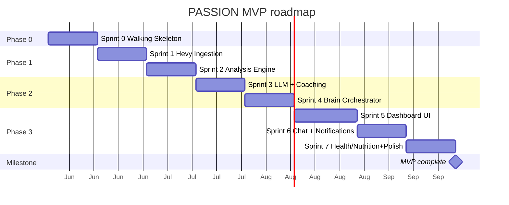

# ROADMAP — Personal AI Operating System (PASSION)

> Phased, sprint-by-sprint plan from walking skeleton to portfolio-ready MVP.
>
> **Version:** 1.0
> **Date:** May 2026
> **Estimate:** ~16-18 weeks at 10-20h/week (MVP = Phases 0→3)

See [ARCHITECTURE.md](./ARCHITECTURE.md), [SPECIFICATIONS.md](./SPECIFICATIONS.md),
[NON_FUNCTIONAL_REQUIREMENTS.md](./NON_FUNCTIONAL_REQUIREMENTS.md),
[API_CONTRACTS.md](./API_CONTRACTS.md).

---

## SEQUENCING PRINCIPLES

1. **Walking skeleton first** — Sprint 0 makes everything *run* end-to-end (Docker,
   DB, Tailscale, auth, observability, CI) before any business logic is stacked on top.
2. **Vertical slices** — each sprint ships a complete, usable slice (DB + logic +
   API/UI), not a horizontal layer. You can *see* something work at the end of each.
3. **Dependency order** — data → analysis → intelligence → interface → completeness.
   The LLM can't coach without analysis context; analysis needs workout data first.
4. **TDD/BDD loop** — the Gherkin scenarios in SPECIFICATIONS.md become each sprint's
   acceptance tests (pytest-bdd). Red → Green → Refactor on critical modules.

---

## TIMELINE OVERVIEW

---

## PHASE 0 — FOUNDATIONS

### Sprint 0 — Walking Skeleton (~2 weeks)

**Goal:** every container runs and the end-to-end plumbing is proven. Nothing
useful yet, but the foundation is solid.

**Deliverables**
- `docker compose up` → all 10 containers healthy
- PostgreSQL migrated (`alembic upgrade head`) — *already validated*
- Tailscale configured; Caddy routes HTTPS to frontend/backend/grafana
- FastAPI `/health` endpoint returns 200
- Next.js renders a minimal dashboard shell (FR, dark mode)
- **Auth working**: login → JWT → protected route → logout (US-001)
- structlog + Prometheus + Grafana LGTM wired; the API "up" metric is visible
- CI green: ruff + mypy + migrate + pytest all pass
- Backup script runs once and a restore is tested (NFR-REL-003)
- `.env` / secrets management in place

**Covers:** US-001 · NFR-SEC-001/002/003, OBS-001/002/003, MAINT-006, REL-003

**Definition of done:** I log in via Tailscale, see an empty dashboard, and Grafana
shows the API is alive. CI is green on `main`.

---

## PHASE 1 — FITNESS DATA

### Sprint 1 — Hevy Ingestion (~2 weeks)

**Goal:** real workout data flows from Hevy into the DB, autonomously.

**Deliverables**
- `hevy-mcp` container + `HevyClient` (MCP client)
- `sync_hevy` Celery job (Flow 1): incremental, idempotent UPSERT, retry/backoff
- Celery Beat schedule (every 30 min) + `sync_state` tracking
- Bootstrap sync (full history on first run)
- `WorkoutRepository`, `ExerciseRepository`, `WorkoutSetRepository`
- API: `GET /workouts`, `GET /workouts/{id}`, `POST /workouts/sync`
- BDD: `hevy_sync.feature` passes

**Covers:** US-008, US-008b(prep), US-009, US-010 · NFR-REL-002/004/005, PERF-002

**Definition of done:** I log a workout in Hevy; within 30 min it appears in my
dashboard's training log, with no duplicates on re-sync.

### Sprint 2 — Analysis Engine (~2 weeks)

**Goal:** the agent understands my training — PRs, plateaus, stats. Pure logic,
high coverage (this is where TDD shines).

**Deliverables**
- Fitness Service: `pr_detection` (4 types, Epley), `plateau_analysis`
  (context-aware), `stats` (weekly/monthly), `recovery`, `targets`
- Nightly analysis Celery job + materialized-view refresh job
- `exercise_targets` seeded from `training_seed.yaml`
- API: `GET /analysis/{prs,plateaus,targets,muscle-status,stats}`,
  `GET /analysis/exercise/{id}/progression`
- BDD: `pr_detection.feature`, `plateau.feature`
- 90%+ coverage on `services/fitness`

**Covers:** US-011, US-012, US-013, US-013b, US-014, US-015 · NFR-TEST-001/002, PERF-007/008

**Definition of done:** I beat a bench PR → it's detected automatically, and I see
my plateau alerts + target progress on the dashboard.

---

## PHASE 2 — INTELLIGENCE

### Sprint 3 — LLM Router + Coaching (~2 weeks)

**Goal:** smart, personalized, cost-controlled coaching.

**Deliverables**
- LLM Router (3-tier: Gemini Flash / Haiku / Sonnet) + provider clients
- `BudgetTracker` (45 €/month cap, pre-call check, fallback to Gemini free)
- Guardrails (input/output validation, `@sensitive` → Anthropic-only)
- Workout suggestion (Flow 2) + nutrition plan
- API: `POST /coach/suggest-workout`, `/coach/suggestion/{id}/respond`,
  `/coach/nutrition-plan`
- `llm_routing.yaml` wired; LLM cost tracking → Grafana dashboard
- BDD: `workout_suggestion.feature`

**Covers:** US-016, US-017 · NFR-COST-001/002/004, SEC-007, OBS (LLM dashboard)

**Definition of done:** I ask for today's workout → I get a personalized suggestion
adapted to my recovery/sleep, the cost is tracked, and the budget cap holds.

### Sprint 4 — Brain Orchestrator (~2 weeks)

**Goal:** the system runs autonomously — think → plan → execute → reflect.

**Deliverables**
- Brain graph (LangGraph) + `BrainState` + nodes (think/plan/execute/reflect/route)
- Memory Service (RAG, embeddings, retrieval, background extractor) + `agent_memory`
- Brain cycle Celery job (Flow 4), one action per cycle
- Agent action logging (`agent_actions`)
- API: `GET /dashboard/overview`, `/dashboard/system-matrix`, agent status
- US-002 (status), US-004 (memory), US-005 (activity log)

**Covers:** US-002, US-004, US-005, US-007(partial) · NFR-SCA, OBS-004

**Definition of done:** overnight, the brain runs cycles, generates my morning
briefing, and remembers things I told it earlier.

---

## PHASE 3 — INTERFACE + COMPLETENESS

### Sprint 5 — Dashboard UI (~2-3 weeks)

**Goal:** a real, usable dashboard — the face of the system.

**Deliverables**
- Dashboard overview (agent status, missions, health snapshot)
- Training log + workout detail + body scanner (SVG) + PR history
- Analysis views (stats, targets, plateaus, progression charts)
- Nutrition + Health views (snapshot, trends)
- i18n FR, dark mode, responsive (phone + laptop)
- Vitest coverage on hooks + shared components

**Covers:** US-002, US-010, US-011, US-015, US-026 (UI) · NFR-UX-001/002/003/004, PERF-003, COMPAT

**Definition of done:** I open the dashboard on phone and laptop; everything renders
in FR, dark, and fast (Core Web Vitals targets met).

### Sprint 6 — Chat + Notifications (~2 weeks)

**Goal:** real-time coaching conversation + proactive alerts.

**Deliverables**
- WebSocket `/ws/chat` (token streaming, stop, quick actions)
- Direct Line + coach chat UI; conversation/message persistence
- Notifications: ntfy + Resend; daily briefing job (US-006)
- API: chat endpoints, notification config

**Covers:** US-003, US-006a, US-006b, US-020, US-021, US-024 · NFR-PERF-001 (WS), REL

**Definition of done:** I chat with my coach in real-time (streaming), and I get a
morning briefing on my phone + email.

### Sprint 7 — Health/Nutrition Ingestion + Gamification + Polish (~2 weeks)

**Goal:** complete the data picture, gamify, and harden for "production".

**Deliverables**
- Tasker setup + `/health/ingest` (Flow 3) + health repos
- `cronometer-mcp` + nutrition sync + meal suggestions
- Manual health markers (blood panels) — US-027
- Gamification: streaks, missions, XP, weekly challenges
- Hardening: automated backups (cron), alerting rules, docs pass

**Covers:** US-018, US-019, US-022, US-023, US-025, US-027 · NFR-PRIV, REL-003, OBS-005

**Definition of done:** full MVP — all data flowing (workouts, nutrition, health),
gamified, observable, backed up. Portfolio-ready. 🎯

---

## PHASE 4+ — EXPANSION (post-MVP)

Not scheduled; pulled in by interest/value after the MVP ships.

- **New agents:** Career (job hunting), Finance, Social, Code, Journal, Intel
- **Hevy:** webhooks (replace polling), bidirectional sync, custom `passion-hevy-mcp` (Python)
- **Health:** CGM auto-import (Dexcom), custom Android Kotlin bridge
- **Integrations:** Google Calendar, Polymarket (recommendations only, no trading)
- **UX:** TTS, advanced gamification (weekly boss)
- **Security:** 2FA TOTP
- **Intelligence:** self-improvement loop (agent learns from its mistakes), local
  Ollama for high-frequency simple tasks

---

## PER-SPRINT WORKFLOW (definition of ready → done)

Each sprint follows the same rhythm:

1. **Plan** — pick the user stories; write the `.feature` files from SPECIFICATIONS.md.
2. **Red** — write failing BDD/unit tests for the acceptance criteria.
3. **Green** — implement the minimum to pass (services first, then API/UI).
4. **Refactor** — clean up; keep tests green.
5. **Integrate** — run the full suite + drift check; CI must be green.
6. **Commit** — conventional commits; one logical change per commit.
7. **Demo to self** — verify the sprint's "definition of done" manually.

**Commit discipline:** `feat|fix|docs|test|chore|refactor|perf(scope): message`

---

*Generated May 2026 — Frederick × Claude. Roadmap locked. Next stop: Sprint 0.*
